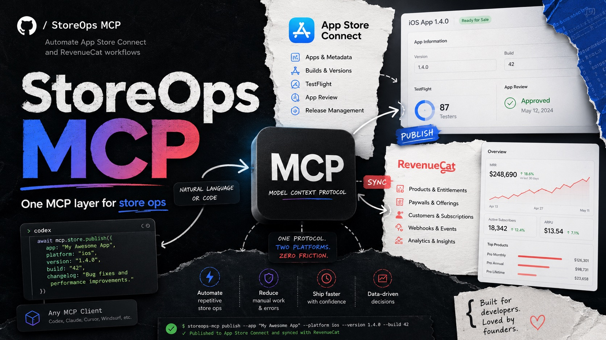

# StoreOps MCP



Automate App Store Connect and RevenueCat workflows from Codex or any MCP client.

StoreOps MCP contains two separate local MCP servers:

- [`appstoreconnect-mcp`](./appstoreconnect-mcp): App Store Connect API tools for apps, builds, app versions, metadata, screenshots, in-app purchases, subscriptions, pricing, and review workflows.
- [`revenuecat-mcp`](./revenuecat-mcp): RevenueCat API tools for projects, customers, products, offerings, packages, and entitlements.

The servers are intentionally split because App Store Connect and RevenueCat have different auth models, permissions, APIs, and failure modes.

Use it to make store operations easier to inspect, script, and automate: app metadata, builds, app versions, screenshots, in-app purchases, subscriptions, RevenueCat projects, customers, offerings, packages, and entitlements.

## Security

This repo does not include credentials.

Never commit:

- `.env`
- RevenueCat secret API keys
- Apple `.p8` private key files
- App Store Connect issuer IDs if your organization treats them as sensitive
- App Store shared secrets

Each plugin includes a `.env.example`. Copy it to `.env` locally and fill in your own credentials.

## Requirements

- Node.js 20 or newer
- npm
- A Codex/MCP client that can launch stdio MCP servers

## Quick Start

Build each plugin:

```sh
cd appstoreconnect-mcp
npm install
npm run build

cd ../revenuecat-mcp
npm install
npm run build
```

Configure credentials:

```sh
cp appstoreconnect-mcp/.env.example appstoreconnect-mcp/.env
cp revenuecat-mcp/.env.example revenuecat-mcp/.env
```

Then edit each `.env`.

## App Store Connect Credentials

`appstoreconnect-mcp` needs:

```sh
ASC_KEY_ID=
ASC_ISSUER_ID=
ASC_PRIVATE_KEY_PATH=/absolute/path/AuthKey_XXXXXXXXXX.p8
```

Recommended role:

- `Admin` for broad automation.
- `App Manager` for many app metadata, IAP, and subscription workflows.

Optional credentials:

```sh
APPLE_IAP_KEY_ID=
APPLE_IAP_ISSUER_ID=
APPLE_IAP_PRIVATE_KEY_PATH=/absolute/path/SubscriptionKey_XXXXXXXXXX.p8
APPLE_SHARED_SECRET=
```

Use an Apple In-App Purchase key for App Store Server API / RevenueCat integration workflows. Use a shared secret only for legacy subscription validation flows that still require it.

## RevenueCat Credentials

`revenuecat-mcp` needs:

```sh
REVENUECAT_API_KEY=
```

Use a RevenueCat secret API key for server-side read/write operations. Do not use a public SDK key for write actions.

## Tools

### `appstoreconnect-mcp`

- `appstoreconnect_auth_status`
- `appstoreconnect_request`
- `appstoreconnect_list_apps`
- `appstoreconnect_get_app_store_versions`
- `appstoreconnect_list_builds`

### `revenuecat-mcp`

- `revenuecat_auth_status`
- `revenuecat_request`
- `revenuecat_list_projects`
- `revenuecat_get_subscriber`

The generic request tools are included so agents can use API endpoints that do not yet have dedicated helper tools.

## Manual Smoke Tests

App Store Connect:

```sh
cd appstoreconnect-mcp
set -a
source .env
set +a
node dist/index.js
```

RevenueCat:

```sh
cd revenuecat-mcp
set -a
source .env
set +a
node dist/index.js
```

In a Codex/MCP client, call the corresponding `*_auth_status` tool first.

## Codex Plugin Use

Each plugin folder has:

- `.codex-plugin/plugin.json`
- `.mcp.json`
- `skills/.../SKILL.md`

Register either folder as a local Codex plugin, or copy the folder into your local plugin directory and add it to your personal marketplace.

The `.mcp.json` files launch `node dist/index.js`, so run `npm install` and `npm run build` before use.

For a setup where Codex discovers both plugins by default, see [`INSTALL.md`](./INSTALL.md#install-by-default-in-codex). That path uses `~/plugins` plus a personal `~/.agents/plugins/marketplace.json` entry with `"installation": "INSTALLED_BY_DEFAULT"`.

After the plugins are enabled in Codex, invoke them with normal language or direct tool names:

```text
Use appstoreconnect_auth_status with check_jwt=true.
```

```text
Use appstoreconnect_list_apps with limit 10.
```

```text
Use revenuecat_auth_status.
```

```text
Use revenuecat_list_projects.
```

If a current Codex thread does not see newly installed tools, start a new thread or restart/refresh Codex. MCP tools are often loaded when a session starts.

## Write Operations

These MCPs can be extended to create and edit production data. Before enabling broad write tools, keep these guardrails:

- Prefer read-only fetches first.
- Require exact resource IDs for writes.
- Show method, path, and JSON body before mutation.
- Keep destructive operations behind explicit confirmation.
- Use least-privilege API keys where practical.

## License

No license has been selected yet. Add one before public reuse if you want others to have explicit rights to modify and redistribute.
